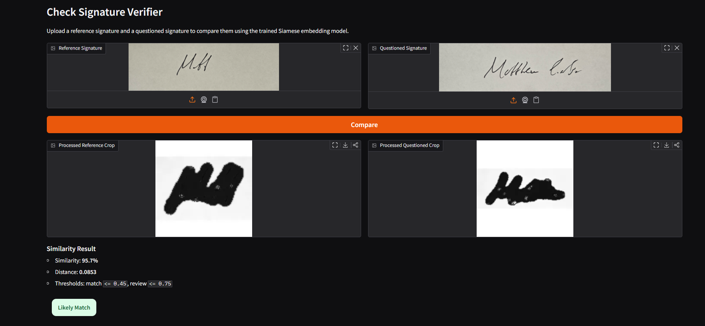
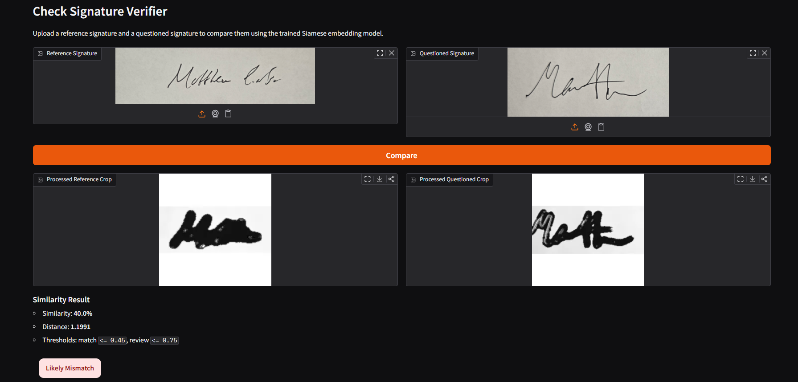

# Case Study: AI-Assisted Signature Verification POC

## Overview
This proof of concept demonstrates how AI can assist with offline signature verification on checks and similar documents. The goal was not to build a production fraud platform, but to create a simple, credible workflow that shows how a reference signature and a questioned signature can be compared and scored locally.

The result is a working Python-based demo that:
- preprocesses signature images into a consistent format
- trains a Siamese neural network on genuine vs different-writer samples
- compares two uploaded signatures and returns a similarity score and verdict
- runs locally through a lightweight Gradio interface

For a client conversation, the value is straightforward: this is a working example of how a signature-verification workflow could be structured before a larger pilot on real client data.

## What Was Built
The POC follows a standard offline signature-verification pipeline:

1. **Preprocessing**
   Signature images are cleaned, cropped, normalized, and resized to a fixed `224x224` input.

2. **Embedding Model**
   A Siamese model based on a pretrained `ResNet-18` backbone converts each signature into a compact embedding vector.

3. **Similarity Scoring**
   The two embeddings are compared by Euclidean distance. Lower distance means more similar signatures.

4. **Demo Interface**
   A Gradio app allows a user to upload two signatures, view processed crops, and receive a verdict of `match`, `review`, or `mismatch`.

## Sample Results
The screenshots below show the POC separating a same-writer comparison from a different-writer comparison on controlled sample data.

### Example 1: Likely Match
The model correctly identifies two signatures from the same writer as a strong match.

### Example 2: Likely Mismatch
The model correctly identifies a different-writer comparison as a mismatch.

## What This Demonstrates
This POC shows that the end-to-end workflow is viable:
- signature preprocessing works
- the model can be trained quickly on a small controlled dataset
- same-writer vs different-writer comparisons produce clearly different scores
- the result can be presented in a simple business-friendly UI

## Important Limitations
This demo should be positioned honestly:
- it uses a very small controlled dataset
- it is not calibrated for bank-grade deployment
- it does not prove production error rates
- it does not yet solve arbitrary check-image localization at scale

This is best described as a **workflow demo** or **technical proof of concept**, not a finished fraud-decisioning product.